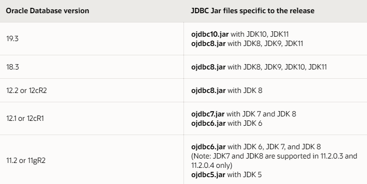

## 역사와 이름
자바의 아버지 제임스 고슬링 이라는 천재 캐나다 개발자의 주도아래 만들어짐
  1991년 썬 마이크로시스템즈(Sun Microsystems) 소속이였을 때
  1996년 1월에 공식적으로 발표
  철학 : "Write once, Read anywhere". 어떤 하드웨어 플랫폼(운영체제가 달라져도)에서도 동작
  일하던 사무실에앞에있던 오크나무를 따라 이름을 오크(Oak)로 지음
  오크를 쓰던 다른 회사와의 분쟁에 의해서 자주마시던 커피 '자바'로 바꿈
2009년 썬 마이크로 시스템은 오라클에 인수됨

JDK : Java Development Kit
JRE : Java Runtime Environment
JVM : Java Virtual Machine

JDK는 크게 2개 버전으로 나뉜다.
- 폐쇄적이고 상업적인 Oracle JDK
- 오픈소스 기반의 OpenJDK.
  Java라는 언어자체는 GPL라이센스로 무료이고 무료이기 때문에 시장지배적 언어가 될수있었다.
Oracle버전에는 OpenJDK에 없는 오라클이 재산권을 보유하고 있는 플러그인들을 제공하는데 
대표적으로 글꼴, Web Start 등


## 자료
[점프투자바](https://wikidocs.net/book/31)

## 종류(Edition)
Java SE : Standard Edition(J2SE). 가장많이 사용하는 표준 에디션.자바의 표준 플랫폼이자 핵심기능을 제공
Java EE : Enterprise Edition(J2EE = Jakarta) : Java SE를 포함하며 다계층, 엔터프라이즈 애플리케이션 개발 환경을 제공
Java ME : Micro Edition(J2ME) : 모바일장치, 셋톱박스, 프린터 등 사물인터넷, 임베디드용 API 및 환경을 제공
Java FX : 경량 사용자 인터페이스 API를 사용해 리치 인터넷 애플리케이션을 만들때 사용
Java Card, Java TV, Java Embedded 등 제한된 하드웨어 환경에서 동작하는 것도 있다.

## 버전
JAVA는 정수버전, JDK는 1.X버전으로 붙어서 자바버전 몇쓰세요?에 헷갈리게 돼있는데
SE1부터 9까지는 1.X버전을 X버전이라고 불렀다.
그러니 8버전이라고 하면 JDK1.8버전이라는 소리다.
SE6 에서 J2SE 에서 JAVA SE로 변경됨.
SE8   2014.03  (제일 많이 쓰고있음)
SE9   2017 .09
SE10  2018.03
SE11  2018.09 (2번째로 많이 쓰고있음)
SE12  2019.03
SE13  2019.09
SE14  2020.03
SE15  2020.09
SE16  2021.03
SE17  2021.09
가장 많이 쓰이고있는 버전은 1.8 , 2번째는 11

### 오라클 버전
9i, 19c, 11g 를 많이 쓰는데
- C : Cloud
- G : Grid
- I : Internet


### 자바와 오라클사이의 ojdbc버전
[공식사이트](https://www.oracle.com/database/technologies/faq-jdbc.html)
The Oracle JDBC driver is always compliant to the latest JDK version in each of the new releases. In some versions, JDBC drivers support multiple JDK versions. Use the table below to choose the correct JDBC driver based on your preferred JDK version.
**요약하자면 ojdbc가 나올당시의 최신 jdk번호를 따라간다.(준수한다)**
구조적으로 당연히 jdk가 먼저나와야 그에맞춘 ojdbc가 나오는거고.
자바가 새로나오면 이전의 ojdbc가 커버 칠수도 있고 못칠수도있다.



## 설치
jdk깔고
JAVA_HOME 설정해주고
PATH추가
근데 오라클에서 자동으로 설정해주는 경로가 있고 PATH는 위에있으면 우선순위먹는다.
이클립스 preference - java - jdk bin까지 설정

일단 이클립스(STS)는 JDK를 통해서 컴파일 하지 않습니다. 기본적으로 내장된 컴파일러를 사용한다. 
바꾸고싶으면 Window > Preferences > Java > Compiler 여기서
그런데 런타인 환경은 사용자가 설치한 (그리고 설정한)것을 사용한다.
바꾸고싶으면 Window > Preferences > installed jre


### 클래스패스 (ClassPath)
JVM이 클래스 파일을 찾는 경로
별도로 지정하지 않으면 현재 디렉토리에서 찾는다.
별도로 하나라도 지정하면 현재 디렉토리가 제외된다. 그러니 모두 추가해줘야한다.
절대경로 상대경로 모두 가능.

#### ClassPath vs ModulePath
클래스패스 : 사용자정의클래스 또는 패키지의 위치
모듈패스 : 사용자 정의 모듈의 위치. JRE는 무조건 여기에있다.
패키지는 하나의 모듈에서만 접근가능하다.

### package
용도1 : 클래스의 이름만 보면 어떤 용도로 사용되는 클래스인지 구분이 어렵기 때문에 클래스를 구분하고 파악하는데 도움
용도2 : 서로 다른 기업에서 만든 같은 이름의 클래스가 있을때 이름 충돌을 해결


## 목차
자바언어의 특징 및 개발환경 구축
자바 프로그램 작성(헬로월드)
변수
기본형 및 형변환
연산자와 연산식(단항, 산술, 비교, 논리, 대입)
조건문과 반복문
메모리 사용 영역
배열, 다차원 배열

메소드
객체

클래스, 유효범위, 접근제어자
생성자, 오버라이딩, 오버로딩, 중간복습
상속, 추상객체, 인터페이스
다형성
예외
컬렉션 프레임워크, 총복습


## 모르면 고생하지만 제대로 알려주지 않는 것
- 하나의 .java파일에 여러 클래스가 있어도 된다. 단, public 클래스는 하나만 있어야한다.
- 모든 변수는 클래스 안에 들어가야한다. (static은 아예 인스턴스가 없어도 생성되는 개념이니까 아무데서나 선언될수있다.)

### 1. getter setter쓰는 이유
객체의 무결성을 보장하기 위해.
객체지향. '은닉성'를 이해하지못해서 발생하는 의문이지만 좋은 의문이다.

예를들어 Man이라는 클래스의 weight라는 필드가 있고
weight에 -100이라는 값을 주려고 하면 무결성이 깨진다.

이를 방지하기 위해,
필드를 private로 만들어 외부의 접근을 제한한 후,
Setter를 사용해 전달받은 값을 내부에서 가공해 필드에 넣어주는 방식을 사용하고
마찬가지로 필드 값을 가져올 때도,
Getter를 사용해 본 필드의 값을 숨긴 채
내부에서 가공된 값을 꺼낼 수 있습니다.

또한 어떤 회사에서 유료 모듈을 팔면서 사용법을 알려주고 고객사가
사용법 대로 안하고 다른변수에 접근한다거나 올바르지 못한 값을 넣거나 하는 경우를 방지한다.

### 2. super의 의미
자바는 자식 생성자를 호출하기전에 부모 생성자를 자동으로 호출하도록 약속되어있다.
자바는 사용자정의 생성자가 없으면 기본생성자를 만들고, 사용자정의 생성자가 하나라도 있으면 기본생성자를 만들지 않는다.
부모에서 기본생성자가 아닌 명시적으로 정의한 생성자가 있다면 그것을 호출해야한다는 말.
상위 클래스와 하위클래스의 생성자가 하는역할이 같다면 코드를 복사해서 중복이 가져오는 여러 문제를 가져가는것이 아니라, 상위클래스의 생성자를 호출할수 있다면 좋겠지.
이때 사용하는 키워드가 super. 생성자의 코드가 길어질수록 그 효용은 분명하게 드러날 것이다.
하위클래스가 부모클래스를 먼저 초기화하고 자기자신을 초기화해야 한다면, 반드시 상위클래스의 생성자를 호출한 다음에 자신의 초기화에 필요한 코드가 나타나야 한다.

# 변수(Variable)
값을 저장하기 위한 용도
왜 저장하지? 반복해서 사용할경우 하나의 그릇에 담아서 참조하기 위해서,
          값에 이름을 붙여주기 위해서
- 변수선언하는법 : 자료형 변수이름;
  // 자바가 해당 자료형의 크기만큼 메모리에 할당하고, 변수이름으로 메모리에 접근할 수 있다.
- 초기화 : 변수에 처음으로 값을 대입해 주는 것
- 변수이름 명명규칙
  - 이름만 봐도 무슨 성격의 값이 들어올건지 유추할수 있는 명사
  - 예약어(키워드) 사용불가
  - 숫자로 시작할 수 없음
  - 대소문자 구분함
  - 카멜케이스(소문자로 시작하고 의미상구분되는단어의 첫글자는 대문자로 구분)
    예) myFavoriteColor      스네이크케이스 my_favorite_color   파스칼케이스 : MyFavoriteColor
  - 특수문자는 _와 $만 가능
  - 상수는 모두 대문자로.  상수가 합성어일 경우 _로 구분

# 자료형(Data Type) ## 데이터타입
  - 기본형 = 원시형 = primitive Type
    > 변수에 실제 '값'을 저장한다.
    > 원시형은 null을 넣을 수 없다.
    > 원시형은 제너릭 타입에서 사용할 수 없다.
    > 원시형은 스택 영역에 올라간다.
    - 자바의 8개 원시형 타입  //*은 디폴트
      - 논리형(*boolean : 크기미정)``
      - 문자형(*char : 2byte)
      - 정수형(byte, short :2byte, *int : 4byte, long : 8byte)
      - 실수형(float : 4byte, *double : 8byte)
      //String 은 기본형이 아님에 유의
  - 참조형 = reference type
    > 변수에 객체의 '주소'를 저장해서 참조한다.
    > 기본형 외의 모든 자료형은 참조형.
    > 스택에는 참조값만 있고 실제값은 힙에 있다.
    > 참조자료형의 크기는 정해져있지 않다. 참조자료형은 new로 생성하여 사용하여야 하는데 String은 예외다.
    - '는 문자.    "는 문자열
    - 왜 자료형이 이렇게 많을까? 메모리의 제약때문에.
      - ex) 소주1병. 소주200L  예를들어 메모리가 8기가인데 모든프로세스가 이 한정된 메모리위에서 돌아가야한다. 어떻게하면 한정리를 효율적으로 쓸수있을까? int는 4byte 할당. char는 1byte.
      1byte는 8bit. 4byte는 32bit. 32비트로 표현가능한 경우의수는? 2의 32승. 약 21억.

얕은 복사와 깊은 복사
  - int a=5;  int b=100;    a=b;     b=300;
  - Student 객체a , Student 객체b 만들고 a=b 한다음 b.name의 값을 변경 해보기.
    a.name의 값도 바뀐것을 확인할 수 있다. 이것이 얕은 복사.


## 캡슐화(encapsulation)
꼭 필요한 기능만 외부에 오픈 : 대부분의 멤버변수와 메서드를 감추고 외부에는 통합된 인터페이스만 제공하여 일관된 기능을 구현하게 함.
알 필요가 없거나 순서라든가 뭔가 잘못써서 오작동이 일어날수 있는건 노출하지 않는다.
알 필요가 없거나 순서라든가 뭔가 잘못써서 오작동이 일어날수 있는건 노출하지 않는다.
캡슐화의 한 방법을 보자. 예를들어 private makeHeader, private generateBody, private makeFooter 는 숨기고
public String getReport(){
  makeHeader();
  generateBody();
  makeFooter();
  return buffer.toString();
}

## 생성자 Constructor객체
역할 : 객체를 인스턴스화(생성) 하는 역할
문법 : 함수와 비슷하게 생겼는데 이름이 클래스명과 같고 리턴값이 없다. 
      new키워드와 함께 생성자를 호출가능.
      예) Apple myfruit = new Apple();
생성할때 필요한 데이터를 강제하는 역할.
클래스에는 반드시 최소한 하나이상의 생성자가 존재.
클래스에 생성자가 명시적으로 없을경우 컴파일러가 디폴트 생성자를 넣어준다.
사용자정의 생성자가 하나라도 있으면 디폴트 생성자는 만들어지지 않는다.
디폴트 생성자는 매개변수와 구현부가 없다.

super는 부모를 말한다.
super(); 부모의 디폴트 생성자를 호출한거다.
명시적으로 적어놓지않으면 자동으로 넣어준다.
자바에서 모든 class는 원시 조상 Object를 상속받고 있다.


# 객체
Object-Oriented Programming(OOP)
프로그램으로 구현할 대상.
프로그램을 구성하는 로직을 '상태,속성 : 변수' 와 '행위 : 함수'로 구분해서 서로 연관된 상태와 행위를 그룹화한 것. 
즉, 서로 연결된것 끼리 객체라는 껍데기를 중심으로 응집시킨것.
예) 고양이라는 객체.
실제의 고양이에서 우리프로그램에서 구현할 고양이는 어떤 속성을 가지고있고, 어떤 행위를 할수있을것인가.
이름, 털색, 키, 몸무게, 품종, 나이
걷기, 뛰기, 점프하기, 구르기, 할퀴기, 자기, 먹기, 

예를들어 댓글기능을 만들었는데 다른 웹사이트에서도 사용할 수 있겠다는 생각이 든다. 이것이 재활용성.
그런데 다른곳에 실제로 사용하려고 하니까 여러가지 문제가 발생한다.
이러한 문제를 완화하기 위해 여러가지 방법, 기능들이 탄생했다.
'추상화' :  문제 또추상화는 해결해야 할는 반영해야 할 현실(너무나 복잡함)을 소프트웨어 방식으로 단순화하는 행위를 말한다.
소프트웨어를 설계한다는 것은 복잡한 현실을 추상화하는 과정이라고 볼 수 있다.
예) 실제 위성사진 -> 네이버 지도 -> 실제 위치로 박힌 지하철 노선도 -> 우리가 보는 지하철 노선도
'부품화' : 객체를 다른곳에서 재사용한다는 것은 객체가 다른 곳에서 부품으로써 사용되는 것이다.
좋은 객체를 만든다는 것은 로직을 재활용할 수 있게 부품화하는 것.
예) 초창기의 컴퓨터.  현재의 컴퓨터 : 모니터, 본체, 키보드 등이 분리. 그안에서도 또 분리. 어디가 고장났는지 쉽게 알수있고 그것만 교체하면된다.
시대에 따라, 환경에 따라 부품화 및 추상화의 관점은 계속 바뀐다. 무조건 부품화를 하는것이 좋은것이 아니다. 정답이 없다.
메소드도 부품화의 예. 메소드가 도입되면서 과거와 비교해서 훨씬 편하게 프로그래밍 할 수 있게 되었으나 소프트웨어의 규모가 커지면서 또다시 메소드가 없었을때와 같은 경험을 하게됨. 그리하여 도출된 기능이 객체지향.
'은닉화, 캡슐화' : 어떻게 동작하는지 원리를 몰라도 사용법만 알면 사용할 수 있다. 즉, 객체가 어떻게 생겼는지 몰라도 객체를 사용할 수 있게 하자는 것.
(본체와 모니터를 연결하는 법만 알면 모니터 사용가능)
'인터페이스' : 규격을 표준화하면 다른것으로 교체가능.

# 프로그래밍의 5원칙
<초보용>
- Divide and Conquer(작은 문제로 나눠서 분할정복하라)
- 중복의 제거
- 가독성을 높여라(주석, 네이밍, 들여쓰기)

SOLID
1. SRP (단일책임의 원칙 : Single Responsibility Principle)
2. OCP (개방폐쇄의 원칙 : Open Close Principle) : 확장에는 열려있고 변경에는 닫혀있어야 한다.
3. LSP (리스코브 치환의 원칙 : The Liskov Subsitution Principle) : 서브타입은 언제나 기반타입으로 교체될수 있어야 한다. 다형성을 통한 확장성
4. ISP (인터페이스 분리의 원칙 : Interface Segregation Principle)
5. DIP (의존성역전의 원칙 : Dependency Inversion Principle)

## 상속
자식클래스 extends 부모클래스
부모의 변수와 메소드를 그대로 가져다 쓸수있다. 
언제 사용할까?
  1. IS-A 관계 (inheritance)   일반적개념과 구체적관계
  2. HAS-A 관계 (composition)


### overload  ### override
- ##### 오버로딩 : 파라미터가 다른 새로운 메소드를 재정의
  - 메서드명이 같아야 한다.
  - 매개변수의 개수나 타입이 달라야 한다. 
  - 매개변수의 갯수나 타입은 같고 리턴타입만 다른건 영향을 미치지 않는다.(중복문법에러)
  - 사용이유 : 메서드의 이름을 절약할 수 있다.
  - 예) println

- ##### 오버라이딩 : 상속받은 메소드를 재정의
  - 부모메서드와 형태가 같아야 한다.
  - 사용이유 : 부모메서드와 다르게 자식에서 다르게 작동하기 위해

## 다형성 Polymorphism
- 관련개념 : 상속, 오버라이딩, 형변환
- 하나의 코드가 여러 자료형으로 구현되어 다른 실행결과를 실행되게끔 하는 기술
- **하나의 객체가 여러 가지 타입을 가질 수 있는 것**
- 조상클래스 타입의 참조변수로   자손클래스의 인스턴스를 참조할 수 있다.
- **부모는 자식을 담을 수 있지만, 자식은 부모를 담을 수 없다.**
  - 남자는 사람이다. 여자는 사람이다.   는 맞는 말이지만  사람은 여자이다. 는 틀린말
  - 도형 도형1 = new 원();    도형 도형2 = new 사각형();
  - 자식에만 있는 멤버나 메서드는 버려진다.
  - 예) 
    함수(몬스터)   함수(플레이어)   함수(골렘)
    오버로드가 작동되면서 같은함수지만 다르게 작동.
    함수(캐릭터)   하나의 함수로 몬스터, 플레이도, 골렘도 받을수있게 되는거죠.
- 다형성을 잘 활용하면 유연하고, 확장성있고 유지보수가 편리한 프로그램을 만들수 있다.
- 정보은닉, 상속과 더불어 객체지향 프로그래밍의 가장 큰 특징 중 하나

- 실제 인스턴스 타입을 확인하려면 instanceof연산자
예)
```java
Animal 독수리 = new 독수리(); //이름이 같아도 서로다른놈으로 인식됨
Animal 호랑이 = new 호랑이();
Animal 코끼리 = new 코끼리();

public void moveAnimal(Animal animal){
  animal.move();
}
가 있을때 아래와 같이 호출하면
test.moveAnimal(독수리)
test.moveAnimal(호랑이)
test.moveAnimal(코끼리)
다 제각각의 오버라이드된 move가 호출된다.
```
예2)
```java
고객 customerT = new GoldCustomer(10030, "Edward");
고객 CustomerP = new VIPCustomer(10050, "Kim")

```


## 배열 Array
> 동일한 자료형'의 '순차적'인 자료구조
> 같은 데이터타입의 연관된 여러개의 데이터를 하나의 변수에 담아서 쉽게 관리할수 있도록 해주는 자료구조중 하나
- 인덱스는 0부터 시작한다.
- 장점 : 인덱스를 활용하여 빠른 참조가능
- 단점 : 크기가 선언시의 크기에서 바꿀수 없다.
- 생성법 : 자료형[] 배열이름 = {값1, 값2, 값3...};
        자료형[] 배열이름 = new 자료형[크기];
- 사용법 : 배열이름[인덱스];
배열의 모든요소 **출력** : Arrays.toString(배열명) 쓰거나 아래처럼 반복문
```Java 
  String[] memebers = {"최진혁", "최유빈", "한이람"};
  for (String e : members){ // 향상된 for문
    System.out.println(e +"이 상담을 받았습니다.");  //하나하나의 원소에 대해서 무슨처리를 할것인지
  }

```

```Java
//크기 할당 & 초기화 없이 배열 참조변수만 선언
int[] arr;
int arr[];

// 선언과 동시에 배열 크기 할당
int[] arr = new int[5];
String[] arr = new String[5];

// 기존 배열의 참조 변수에 초기화 할당하기
int[] arr; arr = new int[5]; //5의 크기를 가지고 초기값 0으로 채워진 배열 생성

// 선언과 동시에 배열의 크기 지정 및 값 초기화
int[] arr = {1,2,3,4,5};
int[] arr = new int[] {1,3,5,2,4};
int[] odds = {1,3,5,7,9};
String[] weeks = {"월","화","수","목","금","토","일"};

	intArr3 = {1,2,3,4,5};	//C언어 형식. 자바에서는 문법에러
  //Array constants can only be used in initializers
  //배열상수는 초기화에만 사용할 수 있습니다.
  intArr3 = new int[]{1,2,3,4,5};	//Java형식

// 2차원 배열 선언
int[][] arr = new int[4][3]; //3의 크기의 배열을 4개 가질 수 있는 2차원 배열 할당
int[][] arr9 = { {2, 5, 3}, {4, 4, 1}, {1, 7, 3}, {3, 4, 5}};

```

데이터는 중괄호로 감싸고 각값은 쉼표로 구분. 데이터의 모임이라는 표시를 하는 []에 저장.
  데이터타입[] 배열명 = {해당데이터타입의 데이터1, 해당데이터타입의 데이터2, 해당데이터타입의 데이터3...}
설명 :
  변수의 진정한 의미 :  "반장 이리 와봐" 라고 하면 선생님은 그반의 반장이 누군지 몰라도됨. 반장이 바뀌더라도 반장이 호출됨.  하드코딩 방지(유연성 증가)
  배열의 진정한 의미 : 순서가 원소들이 어느 집합에 소속됨.  "5번 p.5페이지 읽어"  5번이 누군지 몰라도됨.
                      1번 상담끝, 다음 2번, 다음 3... 학생의 총원과 상담한인원이 같으면 상담 끝.
핵심 :
  - **인덱스(index)** : 색인 : 내용이 어디에 적혀있는지 알려주는 역할. 주소를 나타냄. 0부터 시작.
  - 정의할때 반드시 배열에 몇개의 값을 담을수 있는지 꼭 지정해야 한다. 즉 **배열의 길이는 최초 선언한 값으로 고정**됨. 배열의 최대단점

  - 배열이 갖고있지 않은 인덱스에 접근하면 OutOfBoundsException발생. 파이썬이나 자바스크립트 같은 고급언어에서는 크기가 자연적으로 변경되는데 자바는 왜 이렇게 융통성이 없게 만들어놨을까?
  현실에서 50가구가 살 아파트를 지었는데, 이미 짓고나면 51가구가 들어올수있나? 없다.
  그럼 50가구를 살 것이지만 넉넉잡아서 100가구가 살도록 만들면 안되나?  부동산 가격이 매우 비싸기 때문에 현실적으로 불가능.
  바로 컴퓨터 세상에서도 가장 비싼자원인 메모리에 공간을 할당받기 때문에 딱맞게 쓸만큼만 할당해서 효율적으로 사용해야 한다.**메모리에 연속적으로 할당됨.**
  그런데 자원의 효율적인 활용을 위해서 인간이 너무 불편하다. 그 불편을 극복한것이 **컬렉션(Collection)**
  - 자바의 배열은 처음설정된 크기가 고정적이 되어 변동될 수 없다.
  이런 치명적인 단점이 있기 때문에 실무에서 배열 그 자체로는 잘 쓰이지 않고,
  다른 자료구조의 부품으로써 주로 쓰인다.
  - length메서드는 현재 배열에 담겨있는 원소의 갯수가 아니라 배열에 담을수 있는 원소의 갯수. 즉 고정된 크기를 반환한다. 고급언어에 속하는 좀더 쉬운언어에서는 보통 담긴 갯수가 리턴된다.
  - 향상된 for문을 for-each문이라고 한다. while문에서 반복해서 사용하는 패턴을 따로 문법적으로 승화한것. 배열과 반복문은 매우 밀접한 관계
    이 문법이 없다면 배열의 담긴 값을 하나씩 꺼내서 처리하는것을 위해서 배열의 크기를 알아야하고, 반복을 위한 기본값을 세팅해야하고, 그것을 1씩 증가시켜야 하는 노가다 작업의 불편함이 있다.


### Arrays 객체
  - 값으로 인덱스 빼오기 :  Arrays.asList(배열명).indexOf(값)
  - 정렬 : Arrays.sort(배열명);


## 접근제한자, 접근제어자
private : 해당 클래스에서만 접근이 가능
default : 해당 패키지 내에서만 접근이 가능
protected : 동일 패키지의 클래스 또는 해당 클래스를 상속받은 다른 패키의 클래스에서만 접근이 가능
public : 어떤 클래스에서라도 접근이 가능


# 패키지
패키지는 논리적 주소,
폴더는 물리적 주소
실제로 서로 다른 폴더에 있더라도 패키지가 같으면 프로그램은 같은곳에 있다고 인식한다. 물리적 폴더가 없더라도 논리적으로 같은곳에 있다고 인식한다.
예) a폴더밑의 b폴더밑의 c폴더에서 import kr.co.human.클래스1
    x폴더밑의 y폴더밑의 z폴더에서 import kr.co.human.클래스1
    같은 위치의 클래스를 가져올수 있다.
예2) import kr.co.human.클래스2
     import com.google.클래스2
     클래스이름이 같지만 오류없이 둘다 구분해서 가지고온다.

목적 : 같은 이름의 변수를 쓸수있게 하기 위해서.
  같은 이름의 변수를 서로 다른 클래스에서 쓸수있듯이
  같은 이름의 클래스를 서로 다른 패키지에서 쓸 수 있다.
//프로그램이 커지게 되면 같은 이름의 클래스가 생겨날 가능성이 높다.

## 메소드 Method  ## 함수
메소드와 함수는 같은 의미.
설명 : 자주 사용될만한 특정작업을 정의해두고 호출할때는 한문장으로 써서 코드의 양을 극단적으로 줄일수 있으며 재활용성이 높아진다. 유지보수가 유리해진다.

문법 :
  접근제한자 리턴타입 메소드명(인자타입 인자명, 인자타입 인자명...){
    함수본문;
    리턴타입 void가 아닐경우 리턴문;
  }
핵심 :
- 메소드가 없다면 얼마나 불편한지 체감해야한다.
- 매개변수-파라미터(parameter)와 전달인자-아규먼트(argument)는 서로다른것.  매개파라 전달아규
  매개변수는 정의할때 나열한 변수
  전달인자는 함수를 호출할때 전달되는 실제값
- 마찬가지로 왜 귀찮게 리턴타입이나 인자 타입을 명시적으로 지정해두게 했을까?
  모든일에는 장단점이 있고 언어의 철학에 따라 선택된다.
  String으로 고정되면 사용하는쪽에서는 String이 아닐거라는 생각을 할 필요가 없어진다. 그래서 문자열인지 숫자인지 체크하는 조건문같은것을 안넣어도된다. 컴파일시 에러를 발견할수 있다.
- return을 만나면 리턴뒤에 오는 값을, 메소드를 호출한곳으로 돌려주면서 메소드의 실행을 완전히 종료한다.
  그럼 왜 본문에서 처리안하고 return으로 결과값을 외부로 돌려주는 방법을 쓰는가?
  부품으로써 사용하기 위해서
  어떤 특정한 용도로만 사용할 수 있는 부품이 된다는 것은(예를들어 화면에 출력) 부품으로서의 가치가 떨어진다는 말과 같다.
- 배열은 메소드와도 매우 밀접한 관계
  인자나 리턴으로 여러개의 값을 다룰수 있게 한다.


## 객체지향
- 서론
  이제 자바 수업의 중간이다.
  사실 이때까지 배운것은 모두 절차적 프로그래밍이였다. 절차지향이라는 탄탄한 토대위에서 객체지향은 구축된다.
  자바는 객체지향을 강제하고있다. 그러나 문법적으로 강제한다고 해서 객체지향적 코딩을 할수있는것은 아니다.
  한국어 문법에는 어긋난것이 없지만 아무런 의미를 전달할 수 없거나 이상한 의미를 전달하는 것처럼.

### Object Oriented Programming (OOP)
객체를 지향한다는것이 도대체 무슨말인가? 객체를 먼저 이해해야한다.
객체 : 서로관련있는 **상태**와 **행위**로 모아둔 집합
    *상태 : 변수
    *행위 : 메소드
    그 객체들을 블록처럼 조합해서 하나의 완제품을 만드는것이 객체지향 프로그래밍.
  핵심은 객체들간의 '관계'다.
객체의 기능과 역할 :
  - 높은 응집도
  - 재활용성
  - ### 추상화 : 현실의 미치도록 복잡한 것에서 관심있는 요소에만 집중해서 단순화하여 추출한 것
  즉 해결해야할 현실의 문제를 소프트웨어 방식으로 단순화하는 행위.
  예) 위성사진 -> 지적도 -> 실제 노선도 -> 우리가보는 노선도
  - ###  부품화 : 객체를 다른객체에서 재사용할 수 있게 만드는 것
  예) 초창기의 일체형 컴퓨터 : 하나만 고장나면 통째로 바꿔야한다. 부품화하면 키보드, 스피커, 모니터, 램 고장난 그것만 바꾸면됨. 무엇이 고장났는지 쉽게 알수있음.
  요즘 애플에서 새로 나오는 컴퓨터는 다시 단일화 됐는데요? 부품이 경량화되면서 부품화에 대한 매력이 반감되는 등 시대에 따라 관점이 계속 바뀌기 때문.
  소프트웨어 세상에서는 부품의 설계도를 바꾸면 그 부품을 사용하고있는 모든 곳에서 동시다발적으로 개선이 이루어짐.
  메소드는 부품화의 예
    - 은닉화(Information Hiding), 캡슐화(Encapsulation) : 어떻게 만들어졌는지, 동작원리가 뭔지를 몰라도 사용할수있음. 내부의 속성과 동작방법은 캡슐안에 숨기고 사용자에게는 사용법만 노출

    객체, 인스턴스, 상속, 추상클래스, 인터페이스
      - ## 객체 : 소프트웨어로 구현할 대상. 개념.
      - ## 클래스 : 설계도
      - ## 인스턴스 : 클래스(설계도)로 구현된 구체적인 실체
      - ## 추상클래스 : 추상적인 클래스. 상속을 강제하는 역할
            자식 extends 부모.   하나의 부모'만' 가질수있다.
      동물 > 척추동물 > 포유강 > 식육목 > 고양잇과 > 표범아과 > 표범
      - 클래스가 미완성이라는것은 추상메소드가(abstract가 붙은 메소드) 하나 이상 포함된 클래스라는 말.
      - 추상클래스로 인스턴스 생성은 불가능. 상속을 통해서 자식클래스에 의해서만 인스턴스를 생성할 수 있다.   부모가 만들어놓은것을 이어받아 자식이 완성시켜야한다.
      - **사용목적** : 공통구현을 상위클래스에 뽑아내어 상속을 통한 코드의 중복을 제거
      - 왜 추상메소드를 뒀을까? : 맥락에 따라 달라질 수 있는 기능이 있을때. 
        즉 코드의 중복을 막고 유지보수를 편하게 하려고.
          // 공통적인 변수는 private으로 해놓으면 자식에서 사용못하니 유의.
      - 그냥 클래스를 상속받는것과 추상클래스를 상속받는것의 차이는?
        : 자식클래스에서 추상클래스를 반드시 구현하도록 강요하기 위해서는 추상클래스여야 한다.
        자식에서는 미완성된 메소드를 오버라이딩하여 완성시켜서 사용해야한다.
        그냥 클래스라면 미완성된 함수를 그대로 쓸 수 있게 된다.
        즉 최소한의 수정으로 유지보수의 편의성을 높이기 위해.
      - ## 인터페이스 : 구현체 implements 인터페이스. 부품들의 결합방식에 대한 ""약속"". 다형성을 구현하는 매우 중요한 역할을 한다. 인터페이스 끼리는 다중상속이 가능하다.
      - 함수의 이름, 파라미터타입, 파라미터갯수, 리턴타입만 약속
      추상클래스는 변수도 있었고, 본문이 있는 함수도 있었고, 추상함수도있었죠.

      예) DVI, RGB, HDMI, DP
      다른 표준대로 만들어진 제품을 꽂으려고 하면 꽂아지는데 동작이 안되는것이 아니라 아예 꽂아지지도 않게 만들어서 고장의 위험을 미리 방지.
      ** '역할'은 인터페이스에 '구현'은 구현체에 **
        문법 : implements 구현할 인터페이스. 여러개의 인터페이스를 구현할수있다.
      예) 220v(동그란구멍 2개), 110v(길죽한 구멍2개)
          HDMI, DP, DVI, RGB
          모양, 핀의수, 데이터의형식 이런게 다르기 때문에 꽂았을때 에러가 나오는것이 아니라 아예 꼽지도 못하도록 만드는 역할
            추상클래스보다 더 추상적(모든메소드가 추상메소드)이여서 본문이 없고 어떻게 구현해야한다고 약속만 한것. 그냥 함수이름만 쓰면 앞에 public abstract이 생략된것.
            멤버변수는 상수(final)만 가질수있다. 이건 반드시 있어야 되거든? 반드시 구현해줘.
            사용목적 : 기능의 강제, 협업
      예2) k3, 아반떼, 테슬라 모델3, 페라리 뭐가됐든 자동차역할을 한다면 운전하다 기능으로 다 운전가능
      예3) 로미오 역할을 구현하는 애가 장동건이든 원빈이든 현빈이든 로미오로 쓰인다.
      쥴리엣.키스하다(로미오)
      Romeo = new 장동건();  이든 Romeo = new 원빈(); 이든
      Juleit.kiss(Romeo)
      실습)
      Animal이라는 추상클래스
      flyer (비행자) 라는 인터페이스
      호랑이, 토끼, 독수리 객체3개를 만들어서 모두 Animal을 상속받고
      독수리만 flyer를 implements 하도록

      추상클래스 vs 인터페이스
      공통점 : 둘다 추상메소드를 오버라이딩 해야한다.
      외우는것이 아니지만 진짜 이해가 안돼서 외우도록 가이드를 주자면
      같은 코드를 반복해야돼서 부모의 것을 물려받아서 중복을 막는다면 추상클래스
      반드시 구현해야하는 기능의 약속이면 인터페이스
      **be(존재)로 구분되면 추상클래스
      do(하는일)로 구분되면 인터페이스.**


      - ## this : 인스턴스화 됐을때의 그 인스턴스 자신을 가르키는 키워드.
      인스턴스 자신의 메모리 주소를 가르키고 반환함.
      생성자에서 또다른 생성자를 호출할때 사용.
              똑같은 변수가 있다면 구분하기 위해서 this를 써줘야한다. 전달받은것이 없다면 의심의 여지가 없기 때문에 this에서 찾는다. 그러나 this를 붙이는것을 습관화하자.
      -  ## super : 인스턴스화 된 자신의 부모
      - 모든 객체의 부모에는 최종조상인 Object를 자동으로 상속받고있다.
      - 부모클래스의 private 은 자식이 물려받을 수 없다.


  ### 상속
  문법 : 자식클래스 extends 부모클래스
  의미 : 부모클래스의 변수와 메소드를 자식에서 그대로 쓸수있다.
  추가 : 
    - 동일한 이름의 변수가 있다면 상속되지 않고 자식의것을 사용.(오버라이드 처럼)
      그냥 참조할때 우선순위를 밑에서부터 올라간다고 생각하면된다. 내거에서 없으면 부모에 있나 보고, 부모에 없으면 조부모에 있나 보고..
    - 때문에 (**유의**)부모에 있는데 자식에 같은 이름 있으면서 null되는거 유의해야한다. 부모에서 자식을 참조하지 못하기 때문. 부모에 있다면 자식에 없애주면 된다.
    - 자식클래스의 생성자의 첫줄에는 반드시 자신의 다른생성자 또는 조상의 생성자를 호출해야 한다. 없다면 컴파일러가 자동으로 super()를 넣는다.
    - 때문에 부모의 디폴트 생성자가 없는데 자식에서 부모의 생성자를 명시하지 않았으면 컴파일 에러가 발생한다.
    - 이런 메커니즘은 최종 조상인 Object클래스의 생성자인 Object()를 호출할때까지 계속된다.
  

    실습 : 추상클래스 자동차(이름, 무게, 최고탑승객수, 현재승객수, 최고속도, 현재속도),
    슈퍼카(터보엔진 등등)
    대중교통(요금을 받는기능:charge, 승객 태우기:take, 승객 내리기:getOff, 최고인원수에 도달했는지 체크하는기능:checkMaxCount)


## 클래스 Class
객체를 만들기 위한 설계도
클래스를 만든다는것은 사용자정의 데이터타입을 직접 만드는것

## 인스턴스 instance
설계도를 따라서 만든 구체적인 제품


## 불편함을 넘어서 절망감을 받아야 한다.
1개를 쉽게함. 비슷한걸 5개를 만들라고? 불편함.
비슷한걸 만개를 만들라고? 절망감.
어떻게 하면 편하게 할수있을까? 역사적으로 수많은 선대의 개발자들이 그것을 해결하려는 노력을 했고 해소되어왔다.


### static 과 final
static : 프로그램이 시작될때 메모리에 한번 할당되어 프로그램이 종료될때까지 해제되지 않도록해준다.
    변수나 메소드앞에 붙어 전역(정적)화 시킨다. 인스턴스를 만들 필요가 없다.
사용이유 : 공유, 메모리의 이점
  
실습 :
  ```java
  public class Counter  {
      static int count = 0;
      Counter() {
          this.count++;
          System.out.println(this.count);
      }

      public static void main(String[] args) {
          Counter c1 = new Counter();
          Counter c2 = new Counter();
      }
  }
  ```
  - 보통 스태틱 메소드는 유틸리티성 메소드(공통함수)에 많이 사용된다. 예를들어 오늘날짜 구하기, 숫자에 컴마 추가하기
  - 에러
    - Cannot make a static reference to the non-static method 에러 : static멤버가 먼저 컴파일 되기 때문에 static멤버의 컴파일 시점에서는 static이 아닌 메서드나 필드는 정의되지 않았기 때문에 사용할 수 없다.

    - Illegal modifier for parameter usersChoice; only final is permitted 에러 : 둘다 static이지만 메소드내부에서 이유는 메소드 내부의 변수는 스택 프레임에만 존재하메소드가 호출될 때마다 새로운 스택프레임을 생성되고 완료되면 폐기한다.


  - 싱글톤 디자인패턴과 관련이 깊다.  단 하나의 객체만을 생성하도록 강제하는 패턴. static과 생성자에 대한 이해가 되었다면 바로 이해된다.

  ```java
  class Singleton {
      private static Singleton one;
      private Singleton() {
      }

      public static Singleton getInstance() {
          if(one==null) {
              one = new Singleton();
          }
          return one;
      }
  }

  public class SingletonTest {
      public static void main(String[] args) {
          Singleton singleton1 = Singleton.getInstance();
          Singleton singleton2 = Singleton.getInstance();
          System.out.println(singleton1 == singleton2);
      }
  }
  ```
    생성자를 private으로 막고 외부 에서 생성할수 없도록 한다. 그리고 자기가 생성자를 호출.
final : 상수


### 예외
에러(Error) : 시스템이 종료되어야 할 상황의 심각한 문제.
    개발자가 미리 예측하여 방지할 수 없다.
    오류는 발생하면 프로그램을 복구할 수 없다.
    고치려면 환경을 바꾸거나 프로세스를 점검
예외(Exception) : 개발자의 로직이나 사용자의 영향에 의해 발생.
    개발자가 미리 예측하여 방지할 수 있다.
    프로그램의 코드로 처리할 수 있다.
    던질수 있는 예외와 던질수 없는 예외로 나뉜다.

- 모든 예외클래스는 java.lang.Exception 클래스를 상속받는다.
- 예외처리를 하게되면 프로그램이 종료되지 않고 계속 정상상태를 유지할 수 있다.

<예외처리 하는 법>
간단 : try, catch, finally 문법
구체적 : try{예외가 발생할 가능성이 있는 코드}
      catch(예외클래스 변수명){ //변수명은 보통 e를 쓴다.
        처리할내용
      }
      finally{
        예외가 있든 없든 처리할 내용
      }
catch여러개 써서 예외별로 처리할 수 있다.
의문. 1. 예외가 발생하든안하든 어차피 그 밑의 문장이 실행될건데 왜 finally를 쓰나요?  => 예외를 제대로 처리한 경우만 밑의 문장이 실행되기 때문.
예외를 처리하지 못했더라도 반드시 실행하고싶은 문장이 있을때 사용
유의 : 예외처리를 중구난방 함부로 쓰게되면 정작 죽어야될 프로그램이 좀비처럼 살기 때문에 유의.


### JDBC
Java Database Connectivity
자바로 DB에 접속하기 위해서 반드시 필요한 API(인터페이스. 깡통)
구현체는 각 DBMS(DataBase Management System)회사들이 구현해야한다.
0. 오라클 설치와 확인
    기본적으로 DBA용계정 SYS, SYSTEM
    교육용계정 HR
    SQLPLUS 사용자계정/암호
    sqlplus / as sysdba
    sqlplus system as sysdba
    왜 어디서나 sqlplus를 실행할수있을까? 시스템 환경변수 PATH설정이 되어있기때문에
1. 유저 생성과 권한
위는 JDBC전의 준비상태
1521     ORCL     SYS/sys1234

1. 드라이버 로드
//어디서 무슨 드라이버를 다운로드 받아야할까? 다운받고나선 뭘 해야할까?
오라클이라면 ojdbc번호.jar 인데 어디서 다운받아야 할까? 오라클 홈페이지겠지.
하지만 오라클을 다운받았으면 이미 있지. 그걸 연동시키면 내컴퓨터에서는 돌아가지만 배포하면 거기서 안돌아갈거니까 프로젝트 내에 포함시켜야지.
    ```java
    Class.forName("oracle.jdbc.driver.OracleDriver");   //오라클
    Class.forName("org.gjt.mm.mysql.Driver");   //mysql
    Class.forName("com.microsoft.jdbc.sqlserver.SQLServerDriver");  //MS-SQL
    ```
    풀패키지를 전달하면 JVM안으로 클래스를 로드. DriverManager에 등록됨.
2. 연결 생성   **Connection**
    why :  자바로 db를 제어하기 위해서
    what : Connection객체를 사용. 연결정보 전달(url, 아이디, 패스워드)
    how :   DriverMAnager클래스의 static메소드인 getConnection()호출
    ```java
    Connection conn = DriverManager.getConnection(url, uid, pwd);
    ```
    이 만들어진 conn 인스턴스가 실제로 DB와 연결되어 작업을 수행하는 통로
    url에는 "jdbc:oracle:thin:@localhost:1521:xe";        //호스트명:포트:전역데이터베이스명
    오라클설치주소\app\oracle\produce\버전\server\ network\ADMIN의 listener.ora  또는 tnsnames.ora 파일에서 포트번호와 전역데이터베이스명 확인가능.

3. 문장 실행  **Statement**
Statement 객체 생성
Statement stmt = conn.createStatement();

4. 결과 사용하기 **ResultSet**
ResultSet 객체 생성
next(), priviouse(), first(), last() 함수가 있다.
while(rs.next()){   //EOF    END OF FILE
    System.out.print( rs.getInt("NO")); //컬럼 이름또는 인덱스 사용가능.
    블라
    블라
} 이런식으로 많이 씀.


### 오라클 제품군
xe : Express Edition
se : Standard Edition
EE : Expression Edition(무료)
---

### 컬렉션(Collection)
[자료](https://st-lab.tistory.com/240)
자바에서 1.2에서 정의됨.
자바에서 미리 만들어놓은 데이터를 수집하고 관리(추가,생성,삭제,초기화,크기,리스트)해주는 목적의 클래스와 인터페이스
- 왜사용하는가? 
  - 일관된 API(Application Programming Interface)
  - 프로그래밍의 노력 감소  //바퀴를 또 발명하지말라.
  - 프로그램 속도 및 품질 향상

- 선언법
(**중요**)   컬렉션종류<데이터타입> 이름 = new 컬렉션종류<데이터타입>();
예) HashSet<String> set = new HashSet<String>();

- 객체 리스트
  - ##### Set
    구현클래스 : HashSet, TreeSet, LinkedHashSet
    중학교때 배웠던 "집합". 순서가 없다.  데이터의 중복을 허용하지 않는다.
    Hash : 임의의 길이를 갖는 데이터를 고정된 길이의 데이터로 변환(매핑)하는 것
      blue  -> 036389274923748934
      blue1 -> 36728657230234904l
     해쉬는 유니크함을 보장하기 때문에 순회할 필요가 없다. -> 검색을 매우 빠르게 할수있다.
     동일한 입력값에 대해서는 동일한 결과값(다이제스트)를 갖는다.
     이 다이제스트의 값을 index로 활용한다.
    함수 : equals() 들어있는요속가 같은지 검사, hashCode(), removeAll(), contains(값), remove(값)   add(), size()
    정의예 : HashSet<String> alphabetSet = new HashSet<>();
            for(String spell: alphabet){
                alphabetSet.add(spell);
            }
    
  - ##### List
    구현클래스 :  ArrayList, LinkedList, Vector
    배열의 최대단점인 초기화했을때의 크기로 고정되는것을 해결한 자료구조
    순서가 있는 데이터의 집합으로 데이터의 중복을 허용
    함수 : add(값),  addAll(리스트),   remove(인덱스),   clear(),   size()
          get(인덱스),   indexOf(값),   lastIndexOf(값)
    예시 : al.remove(5);	//오버로딩에 의해서 인덱스로 지우기
	         al.remove(Integer.valueOf(5));	//오버로딩에 의해서 값으로 지우기
    반복문과 결합 :   향상된for문  for(자료형 이름 : 리스트)
                     while(iterator.hasNext()){//위에서 컬렉션인스턴스.iterator()로 만들어놔야됨
                        이터레이터명.next();
                     }  
    예제 : 
    ``` java
        // ArrayList 선언
        ArrayList<Integer> al = new ArrayList<Integer>();
  
        // ArrayList에 데이터 입력
        for (int i = 1; i <= 5; i++)
            al.add(i);
  
        // 결과 출력
        System.out.println(al);   //[1, 2, 3, 4, 5]
  
        // 3번 데이터 제거
        al.remove(3);
  
        // 결과 출력
        System.out.println(al); //[1, 2, 3, 5]
  
        // 하나씩 가져와서 결과 출력
        for (int i = 0; i < al.size(); i++)
            System.out.print(al.get(i) + " ");  //1 2 3 5
    ```

  - ##### Queue
    구현클래스 :  LinkedList, PriorityQueue
  - ##### Map
    구현클래스 : Hashtable, HashMap, TreeMap
    **키(Key), 값(Value)의 쌍**으로 이루어진 데이터의 집합
    함수리스트 : put, get(키)
    //주의.  키로 벨류찾기는 get함수로 쉽게 찾는데 벨류로 키 찾는 메소드는 없다.
    keySet() 메서드와 for 문을 사용해서 특정키가 있으면 추출
    ```java
    Object[] values = dictionary.values().toArray();  //값리스트. 한글단어
    Object randomkorWord = values[randomNum];	//랜덤 한글단어
    
    Object[] keys = dictionary.keySet().toArray();	  //키리스트. 영어단어
    String randomEngWord = (String) keys[randomNum];		//랜덤 영단

    ```


// 직접 위의 함수들 구현해보는것 좋은 공부다.  private int[] nums,    private int current;

### String 문자열 클래스
이제야 눈에 보이는 스트링. 원시타입아니다.
자바에서 컬렉션으로 만들어 놓은 자료구조다.
charAt(), compareTo(), concat(), indexOf(), trim(), toLowerCase(), toUpperCase(), substring, length(), isEmpty(), contains() 문자의위치반환 없으면-1, matches(정규식) 등의 함수가 있다.
스트링은 값이 달라질때 새로운 객체를 만들어서 할당받는다.

//자바에서 문자열1에서 문자열2를 포함한 갯수 찾기
```java
	  public int getCountInclude(String str1, String str2){
	      boolean include = true;
	      int count = 0;
	      include = str1.contains(str2);	//포함되었는지 참거짓 판단
	      while(include) {	//포함되었다면
	         count++;
	         int where = str1.indexOf(str2);	//시작하는 위치 파악
	         str1 = str1.substring(where+str2.length());
	         System.out.println("str1 : "+str1);
	         //방금찾은거를 빼고 남은 문자열을 부모로 업데이트
	         //substring 함수는 인자가 하나면 해당위치부터 이후로 끝까지 자르는 함수
	         include = str1.contains(str2);
	      }
	      return count;
	   }

```


###### Mutable과 Immutable
- Immutable(불변)  : String, Boolean, Integer, Float, Long
  - new연산을 통해 생성된 인스턴스의 메모리공간은 절대 변하지 않는다.
  - 즉, String의 값이 변하게 되면 메모리공간이 변하는 것이 아니라 새로운 String인스턴스를 만들어 새로운공간을 할당받는다.
  - 기존의 문자열은 가비지 컬렉션에 의해 제거된다.
  - 때문에 당연하게 연산이 적고 조회가 많을때 사용하면 좋고 멀티쓰레드환경에서 안정적이다."
   공유를 하기위해서는 서로 참조하고 있는 주소가 변하지 않아야 하지 않겠는가.
- Mutable(가변) : StringBuilder, Stringbuffer
  
###### 왜자바에서 String은 불변으로 해놨을까?
1. String Pool을 통한 메모리 절약
자바는 스트링을 String constant pool에서 관리를 한다. 가능한이유는 String이 불변이기 때문.
이것을 통해 Heap영역의 많은 메모리를 절약할 수 있다.
같은 값일때 같은 주소를 참조할 수 있기 때문.
만약 String이 불변이 아닌데 풀에서 관리한다면 String변수 a,b,c가 모두 같은 메모리를 가리키고 있을때 a의 값을 바꿔버리면 b,c의 값도 바뀌는 문제가 일어난다.

2. 보안
자바 메소드의 파라미터로 String을 받는 경우는 매우 흔한데
String이 mutable하다면 메서드의 인자로 받은 값은 메서드의 호출자에 의해 언제든지 바뀔수 있게 된다.
이는 엄청난 취약점이다.

3. 동기화
객체가 불변이면 멀티스레드 환경에서도 값이 변할 위험이 없기 때문에 자연스럽게 thread-safe한 특성을 갖게 된다.

4. Hashcode Caching
매번 계산하는 것이 아니라 수정이 없다면 이전 계산값을 그냥 리턴한다.
이렇게 caching이 가능한것도 결국 String이 불변하기 때문에 가능한것


### Object클래스
어떤 자료형이든 상관없이 다 관리할 수 있는 자료형식.
모든 클래스의 최종 부모는 Object다. 그러므로 모든 클래스는 Object다.
객체라면 기본적으로 가지고있어야할 속성과 행동을 정의하고 있다.
(모든 객체가 공통적으로 가지고있어야 할 속성과 행동이 정의되어 있다. 사실 Object클래스에는 필드는 없다. 11개의 메소드만 있다.)
- toString()   //16진수로된 인스턴스의 주소를 출력
- equals()    //참조변수가 가르키는 값을 비교하기 때문에 주소비교. 같은 인스턴스인가\
- clone()
- getClass()  //해당객체의 클래스 타입을 반환


### 제네릭(Generic)
- 뜻 :  포괄적인, 일반적인
Object 를 만들면 사용(저장, 로드)하기전에 형변환 작업을 해줘야하는 불편함이 존재한다.
범용 컬렉션의 장점과 특화된 클래스의 장점을 모두 겸비한 템플릿.
- Java5에서 추가
- 컬렉션, 람다식, 스트림, NIO(New IO)등에서 널리 사용되므로 제네릭을 이해하지 못하면 API 문서를 정확히 이해할 수 없다.

- 목적
    자료형을 일반화. 정의시가 아니라 인스턴스 생성시 자료형을 결정하도록 한다.
    우리가 어떤 자료구조를 만들어서 배포하려고 할때 '여러 데이터타입을 지원하고 싶다.'  그러면 String에 대한 클래스, Integer에 대한 클래스 등등을 하나하나 타입별로 만들어줘야하나? 너무 비효율적이다.
    제네릭은 이런 문제를 해결해준다.
    그렇게 강조했던 메소드의 정의와 호출 다시한번 보자. 어떤 이름으로 넘어오든지 정의한 영역내에서는 이 이름으로 쓰겠다였지?
    마찬가지로 제너릭이라는것은 어떤 데이터타입으로 넘어오든지 이 정의한 영역내에는 넘어온 그 데이터타입으로 쓰겠다 라고 하는것이다.
    즉 데이터형을 정의시 명시하지 않고 호출할때 정할 수 있도록 일반화 한것이다.
    클래스내부에서 지정하지 않고 외부에서 지정도록 한 것이다.
    엄밀히 말하자면 컴파일때 해당 타입으로 캐스팅 하는 것이다.
```java
//일반
List list = new ArrayList();
list.add("hello");
String str = (String) list.get(0);

//제네릭
List<String> list = new ArrayList<String>();
list.add("hello");
String str = list.get(0); // 타입 변환을 하지 않습니다.
```


- 특징
보편적(암묵적)으로 매개변수의 타입으로는 아래의 이름을 쓴다.
    <E> : Element
    <K> : Key
    <N> : Number
    <T> : Type
    <V> : Value
특정범위내로 좁혀서 제한하고 싶다면 extends, super, ? 를 활용한다.
예를들어 <K super T>   이면 T타입의 조상만 가능하고 K로 쓰겠다는 말이다.

- 문법
  - 정의 : 클래스 또는 인터페이스 이름뒤에 <타입파라미터>
     - 생략하면 컴파일러가 제네릭 관련 문장에서 자료형의 이름을 추론한다. 이걸 다이아몬드 표시라고 한다.
     - 타입 파라미터로 명시할수 있는것은 참조타입만 가능하다.
     - 여러개의 타입변수는 쉼표로 구분하여 명시한다.
  - 사용 : 본문에서 그 이름을 데이터타입처럼 사용하면된다.


- 예
```java
public class Box<T>{
    // 클래스 뒤에 <T> 타입 파라미터를 명시했기 때문에 변수의 타입으로 사용 가능합니다.
    private T t;
    public T get() { return t; }
    public void set(T t){ this.t = t; }
}
```

- 장점
1. 런타임에 잘못된 타입이 들어올 수 있는것을 컴파일 단계에서 방지한다.
2. 반환값에 대한 타입 변환(캐스팅) 및 타입검사에 들어가는 노력 줄어듬
3. 코드의 재사용성이 높아진다.

### iterator 와 foreach


### 스트림(Stream)
자바8에서 처음 소개됨. 하천. 개울. 데이터의 흐름이 물의 흐름과 같다는 비유에서 이름이 붙었다.
자바에서 데이터는 스트림을 통해 입출력된다. 마우스든, 키보드든, 모니터든, 파일이든, 디스크든 등등 디바이스에 독립적이다. 한쪽에 input을 주면 한쪽으로 output이 된다.
람다식과 함수형 인터페이스에 익숙하다면 쉽게 이해하고 활용할 수 있다.
예외처리가 많고 클래스가 많아서 코드가 조금 복잡한 편에 속한다.

- 스트림은 크게 2종류로 구분된다. 
  - **바이트기반** 최상위클래스 : **InputStream**, **OutputStream**
          InputStream 내장함수 : read(), close()
          OutputStream 내장함수 : write(), flush(), close()
  - **문자기반** 최상위클래스 : **Reader**, **Writer**
          바이트단위로 데이터를 처리하면 문자가 깨진다. 인코딩에 맞게 2바이트 이상으로 처리하도록 구현되어있다.
          주요하위클래스 : FileReader, InputStreamReader, BufferedReader
          주요메서드 : int read(), int read(char[] buf), int read(char[] buf, int off, int len), void close()
목적 : 여러 파이프들로 필터링 하여 최종 목적에 부합하는 결과를 뽑아내는것.

- 이때까지 써왔던 System.out.println을 보자.
public class System{
    public static PrintStream out;
    public static PrintStream in;
    public static PrintStream err;
}
static이였기 때문에 인스턴스 없이 쓸수있었다. 
System.out = 표준 출력(모니터) 스트림
System.in = 표준 입력(키보드) 스트림
System.err =  표준 에러(모니터) 스트림

예제1. 엔터칠때까지 받기
```java
  System.out.println("알파벳을 여러개쓰고 엔터를 누르세요.");
  int i;
  try{
    while (  (i= System.in.read()) != '\n'   ) {
      System.out.print((char)i);
    } catch(IOException e){
      e.printStackTrace();
    }
  }
```

예제2. 파일에서 읽기
```java
try(FileReader fr = new FileReader("reader.txt")){
  int i;
  while (  (i = fr.read()) != -1  ){
    System.out.print((char) i);
  }
}catch(IOException e){

}
```

예제3. 파일에 쓰기
```java
try(FileWriter fw = new FileWriter("writer.txt")){
  fw.write('A');  //문자하나출력
  char buf[] = {'B','C','D','E','F','G'};

  fw.write(buf);  //문자배열출력
  fw.write("안녕하세요. 잘써지네요");   //String출력
  fw.write(buf, 1,2); //문자배열의 일부출력
  fw.write("65");   //String인숫자출력
}catch(IOException e){
  e.printStackTrace();
}
System.out.println("출력이 완료되었습니다.");
//결과는 ABCDEFG안녕하세요. 잘써지네요CD65
```


예제4. 파일이름 바꾸기
```java
import java.io.IOException;
import java.nio.file.Files;
import java.nio.file.Path;
import java.nio.file.Paths;
import java.nio.file.StandardCopyOption;
//자바7이전 버전에서는 File 클래스의 renameTo() 메소드
//자바7이후 버전에서는 nio의 Files 클래스의 move() 메소드
public class FilesRename {
    public static void main(String[] args) {
 
        Path file = Paths.get("D:\\example\\image.jpg");
        Path newFile = Paths.get("D:\\example\\new_image.jpg");
 
        try {
 
            Path newFilePath = Files.move(file, newFile, StandardCopyOption.REPLACE_EXISTING);  //기존 파일이 존재할 경우 파일을 덮어씀
            // Path가 존재하지않으면 java.nio.file.FileSystemException 발생
 
            System.out.println(newFilePath); 
 
        } catch (IOException e) {
            e.printStackTrace();
        }
    }
}

#### File클래스
Files클래스가 아니다.
File클래스는 파일의 개념을 추상화한 클래스. 입출력 기능은 없고 속성을 알 수 있다.
.isFile()
.isDirectory()
.getName()
.getAbsolutePath()
.getPath()
.canRead()
.canWrite()


```

스트림생성과 사용 예 :
  int[] arr = {1,2,3,4,5};
  int sum = Arrays.stream(arr)			//스트림생성
                  .filter(n -> n%2 == 1)	//filter통과
          .sum();					//sum연산후 결과반환
스트림생성과 사용 예2 :
  String[] names = {"YOON", "LEE", "PARK"};
  Stream<String> stm = Arrays.stream(names);	//스트림생성
  stm.forEach(s -> System.out.println(s));	//최종연산진행

스트림의 특성 : 효율과 성능을 고려하여 지연(lazy) 처리된다.
      즉 위의 코드에서 최종연산인 sum이 호출되어야 filter의 호출결과가 스트림에 반영된다.


#### int와 Integer
int형 변수는 기본형(Primitive type) 변수입니다. 그러기 때문에 실제 값을 저장 장소를 가지만 Integer형 변수는 객체형 변수로서 참조형(Reference Type)입니다, 즉 실제 값이 아닌 객체의 주소를 저장하고 있죠 그렇기에 Null을 가질 수 있는 것입니다.


#### 상수, #### enum
  ##### final 키워드
  - final에 초기값을 줄수있는 경우는 2가지 뿐이다.
  - 필드선언시, 생성자
  - 초기화되지 않은 final 필드가 남아있으면 컴파일 에러
  - 진짜 상수는 static final로 선언. 객체마다 저장할 필요가 없으며 다른값으로 바꿀수도 없기 때문.
  - 명명규칙은 대문자에 언더바 조합


  ##### enum은 열거형(Enumeration). 상수의 그룹을 나타낸다.
주목적 : 우리만의 데이터 타입을 가지기 위해서. 데이터를 제한하기 위해서
- 모든 enum들은 내부적으로 java.lang.Enum 클래스에 의해 상속된다.
- 만드는 문법  : enum 열거체이름 { 상수1이름, 상수2이름, ... }
        예) enum Rainbow { RED, ORANGE, YELLOW, GREEN, BLUE, INDIGO, VIOLET }
- 사용문법 : 열거체이름.상수이름
        예) Rainbow.RED
- 메소드
  - values()	모든 상수 배열로 반환   예) Rainbow[] arr = Rainbow.values();
  - ordinal()	상수 인덱스 반환.   예)  int idx = Rainbow.YELLOW.ordinal();
  - valueOf()	상수 문자 값 반환   예) Rainbow rb = Rainbow.valueOf("GREEN");
예)
```java
enum Day { 
    SUNDAY, MONDAY, TUESDAY, WEDNESDAY, 
    THURSDAY, FRIDAY, SATURDAY; 
} 
  
public class Test { 
    Day day; 
    
    public Test(Day day) { this.day = day; } 
   
    public void dayIsLike() { 
        switch (day) { 
        case MONDAY: 
            System.out.println("Mondays are bad."); 
            break; 
        case FRIDAY: 
            System.out.println("Fridays are better."); 
            break; 
        case SATURDAY: 
        case SUNDAY: 
            System.out.println("Weekends are best."); 
            break; 
        default: 
            System.out.println("Midweek days are so-so."); 
            break; 
        } 
    } 
  
    public static void main(String[] args) 
    { 
        String str = "MONDAY"; 
        Test t1 = new Test(Day.valueOf(str)); 
        t1.dayIsLike(); 
    } 
} 


```


### 랜덤
Random random = new Random(); //랜덤 객체 생성(디폴트 시드값 : 현재시간)
random.nextInt(10)
- 랜덤 클래스의 메소드들
- setSeed(long n) //매개값으로 주어진 종자값이 설정됩니다.
- boolean nextBoolean() //boolean타입의 난수를 리턴합니다.
- double nextDouble() //doouble 타입의 난수를 리턴합니다.
- int nextInt()   //int 타입의 난수를 리턴합니다.
- int nextInt(int n)  //int 타입의 0 ~ 매개값까지의 난수를 리턴합니다.
- double nextGaussian() //	평균이 0.0이고 표준편차가 1.0인 정규분포 난수를 리턴합니다.


### 람다식(Lamda Expression)   ### 람다함수
> 자바8(2014년)에 도입된 함수적 프로그래밍 기법이다. 람다가 포함되면서 자바가 완전해졌다고 말하는 이가 있을정도다.
> 익명함수를 람다함수라고 한다.  **익명함수는 반환타입과 이름이 없다.**
> 함수형프로그래밍이 무엇인지 먼저 알아야 한다. 쉽게 말하자면 최대한 많은 함수를 순수함수로 만들어 유지보수하기 쉽도록 만드는 패러다임이며 디테일하게 말하자면 아래와 같다.
순수함수 :  side effect(부작용 : 부수효과)가 없는 함수
  부수효과는 인풋과 아웃풋이라는 함수 본질이 아니라 반환값 이외에는 함수밖에서 관찰할수 있는 상태변화가 발생하는 모든것을 말한다.
  사이드이펙트를 가진 함수가 많아지면 디버깅하기가 매우 어려워지게 된다. 각 함수 내부를 뒤져서 이게 어디에 영향을 주는지 파악해야한다.
  인풋이 같으면 언제나 같은 아웃풋이 나와야 한다.

  예를들어서 현재시간을 함수내부에서 사용한다면 인풋이 같을때 아웃풋이 달라질 수 있기때문에 순수함수가 아니다.
  순수함수가 될려면 외부에서 시간을 주입받아야 한다.
  그러다보니 동시에 여러함수들이 호출돼도 문제가 없다. 병렬처리가 가능하다.
  그리고 함수형 프로그래밍에서는 모든것을 객체로 취급한다. 함수는 일급객체로 취급한다.
**그래서 사실 람다식은 익명함수가 아니라 익명객체다.**
자바스크립트나 파이썬같은곳에서는 함수가 일급객체라 람다식 사용이 쉬운데
자바는 객체지향프로그래밍 문법이라 함수는 함수고 객체는 객체라 문법적으로 이상해진다.
여기서 어려움이 발생한다. 자바스크립트의 화살표함수로 (a,b) -> a>b? a:b 짜면 매우 간단한다.
let max = (a,b) -> a>b? a:b;
max(5,7);
그런데 자바에서는 아래와 같이 클래스에 종속적이게 만들어야한다.
new Object(){
  int max(int a, int b){
    return a>b? a:b;
  }
}
//  클래스명 인스턴스명 = new 클래스명();   
앞에 대입받는 인스턴스가 없기 때문에 이름이 없는 익명객체다.
객체의 선언과 생성을 동시에 하고있다.
- 자바의 모든 메소드는 클래스 안에만 위치할수있다. 
  즉, 자바에서는 메서드만 따로 전달할 수 있는 방법이 없다. 
  그래서 **매번 인스턴스를 만들어서 전달**해줘야 하고 매우 불편했다. 그것을 해결하기 위해 도입한것이 람다식이며 
  함수형언어에서 함수는 일급객체이기 때문에 클래스에 독립적이다는 개념을 이용한 것이다.
> (**중요**)익명함수를 생성하는 식으로 보이지만 런타임시에 익명 구현 객체를 생성한다.
> 정의문법 :  (데이터타입 매개변수) -> { 실행문; }
              반환타입과 메서드명을 지우고 {} 앞에 ->를 넣으면 된다.
              매개변수가 하나일때 괄호생략가능. 단, 타입을 명시적으로 줬다면 생략불가.
                예) (x) -> {return x*x*x};     x->{return x*x*x};
              본문이 한줄일때 중괄호생략가능. 세미콜론 생략해야됨. 
              그런데 그하나의 문장이 return문이면 {} 생략불가
              그런데 아예 return 키워드를 빼면 또 {} 생략가능
                x-> x*x*x*;
              매개변수의 타입이 추론가능하면 생략가능(대부분 생략가능)
              그래서 (int x, int y) -> {return x+y};
                     (x, y) -> {return x+y};
                     (x, y) -> x+y;
- 예시로 연습
```java
  int max(int a, int b){
      return a>b? a : b;
  }
  변환 : (a,b) -> a>b? a : b

  int printVar(String name, int i){
    System.out.println(name +"="+i);
  }
  변환 : (name, i) -> System.out.println(name +"="+i)

  int square(int x){
    return x*x;
  }
  변환 : x -> x*x

  int roll(){
    return (int)(Math.random()*6);
  }
  변환 : ()->(int)(Math.random()*6)


  for(int i=0; i<10; i++){
    System.out.prinln(i);
  }
  변환 : IntStream.range(0, 10).forEach(콜백함수);  
      //근데 자바에서는 함수만 함수의 파라미터로 전달해줄수가 없다. 그래서 아래와같이 쓴다.
        IntStream.range(0, 10).forEach((int value) -> System.out.println(value));
  
```
- (**실제구현**)
  자바에서는 문법상 메소드만 만들 순 없잖아. 클래스안에 있어야하지.
  그런데 우리가 만들려고하는건 함수 하나다. 그래서 람다식용으로 함수하나만 포함하고있는 인터페이스를 만들거다.
  함수가 단 하나만 있는 인터페이스를 **함수형 인터페이스** 라고 한다. 우리가 쓰레드할때 썼던 Runnable 인터페이스도 run함수 하나뿐인 함수형 인터페이스다.
  함수가 하나밖에 없기 때문에 JVM이 자동으로 무조건 그놈으로 매핑을 해 줄 수 있다.
  그래서 인터페이스 명 = () -> {본문}  을 하면 해당 인터페이스의 익명 구현 객체로 생성된다. 그놈을 인스턴스에 넣어서 쓸거다.
  코드를 예로 한번 보면 훨씬 이해가 쉽다.
  1. 함수형 인터페이스(어떤 함수 하나에 대한 약속)만들기
  public interface Add{
    public int add(int x, int y);
  }
  2. 쓸 클래스의 함수안 람다식 구현하기
  Add 아무이름 = (x,y) -> {return x+y;};   
      //(x,y) -> {return x+y;}   이게 람다식(익명함수)이다.
	  	//그 람다식 전체(이름이 없는 익명함수)가 자동매핑되어 add라는 함수의 본문으로 들어간다.
  1. 호출하기
  System.out.println(아무이름.add(2,3));
- 매개변수타입은 런타임시 대입되는 값에 따라 자동으로 인식될수 있기 때문에 일반적으로 언급하지 않는다.
- 장점.   익명함수(람다식의 장점이지)   자바에서 람다식은 문법상 장점이 상쇄
  1. 코드가 매우 간결해진다.
  2. 인스턴스 생성 안하고 기능실행  //클래스의 인스턴스를 생성하지 않는거지 자바문법상 인스턴스는 있을수밖에 없다.
  3. 함수이름 생각 할 필요없음
  4. 컬렉션요소를 매핑해서 쉽게 집계할 수 있다.
- 단점
  1. 가독성이 안좋아진다.
  2. 함수이름이 없기 때문에 stacktrace보고 디버깅하기 어렵다.
  3. 이 함수가 있음을 인식하기가 어렵다.
- 결론
  위의 단점들때문에 람다식 쓰지말라고도 하는개발자들도 많다.
  본문이 3줄안에 끝나고 단 한번만 쓰임을 보장할수있고 행동이 명확할때만 제한적으로 사용.

- @FunctionalInterface
Functional Interface라는것을 알려준다. '구현해야 할 추상 메소드가 하나만 정의된 인터페이스'를 가리킨다.
그래서 함수가 2개이상있으면 에러를 발생시킨다.


### 배포시 유의할점
포트번호 9000으로 돼있는데 받은 컴퓨터의 서버가 9000아니면 첫페이지만 뜨고 연결못하니까 알려주기
오라클버전 19c
  OJDBC6아니고 8써야되는거 유의
  Deploment에 ojdbc8추가해줘야 하는거 유의
  SID XE아니고 ORCL인거 유의
  c## 아이디에 붙여야되는거 유의
  테이블 만든 계정으로 접속하든지 시노님 붙여줘야 하는거 유의

11g에서는 :xe 붙여주니까 됨.
2개다 Deploment 에 추가해줘도 ojdb6 방식으로는 접속안됨.
