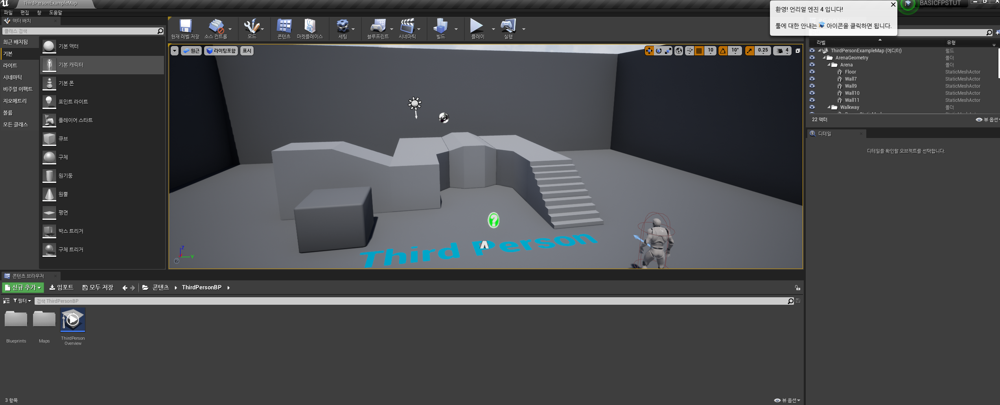

1. [프로젝트 생성](https://www.udemy.com/course/unreal-engine-4-fps-tutorial/learn/lecture/5760742#overview)
3인칭 - 블루프린트 - 기본요소 포함

   1. 왼쪽밑 소스패널 보이기 버튼 클릭
   2. Content - New Folder - 이름 EnemyAI로 바꾸기
   3. Content - ThirdPersonBP - Blueprints - ThirdPersonCharacter 우클릭 - duplicate(ctrl w) - 이름 AiActive로 바꾸기 - EnymyAI로 드래그앤드랍후 여기로 이동
   4. 다시 원래 3인칭캐릭터 블루프린트 더블클릭
   
   5. 플레이 누르고 바탕화면에서 WASD와 방향키로 조작해보기
   6. 소켓. 이객체에 따라다니는것. 근데 안보이네
   7. 카메라를 머리에 씌우고 다시 플레이 해보기 
   8. 캐릭터 블루프린트 더블클릭
      1. Use Controller Rotaion Pitch
      2. Use Controller Rotaion Yaw
      3. CameraBoom - FollowCamera - 오른쪽 Camera Settings - Use Pawn Control Rotation

### 1인칭 게임
##### 다른프로젝트에서 가져오기
https://www.udemy.com/course/unreal-engine-4-fps-tutorial/learn/lecture/5760748#overview
프로젝트명 : StealAssetsFRom
   1. 콘텐츠 탭 열고 FPWeapon 우클릭 Migrate(이주)해서 위에서 했던 3인칭 게임 BASICFPSTUT의 Content에 넣기
   2. FirstPersonBP의 Blueprints의 FirstPersonProjectile(노란거) - 우클릭 Asset Action - Migrate
   3. 원래 프로젝트가서 확인

##### 캐릭터에 총 붙이기
   1. ThirdPersonBP - Blueprints - ThirdPersonCharacter 더블클릭 후 뷰포트
   2. FirstPerson - FPWeapon - Mesh - SK_FPGun 더블클릭
   3. SK_FPGun 드래그앤 드랍으로 열려있는 ThirdPersonCharacter의 Mesh안으로 넣기
   4. 회전, 크리 등 조정하고 실행해보기

#### 총알 나가게 하기
   1. FirstPersonCharacter에 있는 EventGraph 에서 Spawn projectile 복사
   2. ThirdPersonCharacter - Event Graph에 붙여넣기
   3. 컴파일해서 에러 고치기
   4. Edit - project settings - Engine - input - Action Mappings  
      + 버튼 - InputFire  button은 left moust button 이름은 InputFire
   5. 컴파일하고 방금만든 Action가져오기
   6. 기존거 지우고 play Anim Montage 만들기
   7. Pressed 화살표 드래그앤 드랍으로  play Anim Montage에 끌어넣기
   8. output은 SpawnActor None에 붙여주기
   9. 타깃은 드래그앤드랍으로 바깥쪽으로 내서 get player character선택
   10. 변수만들기 디폴트에 GunOffSet 벡터로 만들고 컴파일한다음 
       x는 102, y는 18, z는 20
      따라만 하면 힘든거 많은데 스샷 잘보고 고침
   11. FirstPersonBP - Blueprints - FirstPersonProjectile 더블클릭 뷰포트에서 크기 0.05씩으로 작게함
   12. projectile Initial Speed , Max speed  2만으로

#### 밤 시간 나누기
맵의 개념적벽, 물리적 벽 다 크게 넓힘
StarterContent - Materials
   1. 맵 수정한 다음, 조명 이동
   2. 플레이 옆에 있는 빌드 버튼 선택하고 조명 리빌드
   3. 태양표시 Intensity 는 밝기 0 이면 완전밤
   4. 하늘클릭하면 별빛, 구름투명도, 구름스피드 등도 있다.