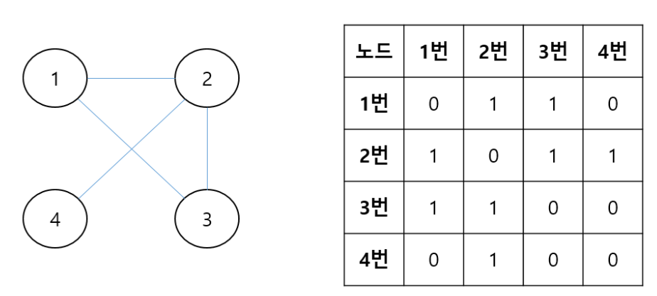
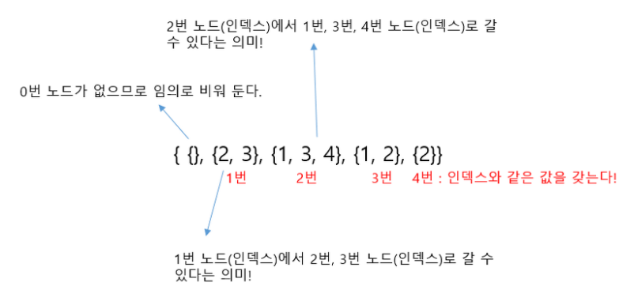

# 해시(Hash)
> 키를 입력하면 고정된 길이의 알수없는 난수(해시값)를 출력한다.
  이때 사용되는 함수를 해시함수라고 한다.
> 한글자만 바껴도 완전히 다른 결과가 출력된다.
> 출력값을 보고 입력값을 예측할 수 없다. 역추적이 안되는 단방향
- 해시충돌
  : 완전히 다른 입력값에서 동일한 출력값이 나온 경우.
- 주로쓰이는 분야
  - 암호화
  - 복제문서 판별
  - 빠른 검색
  - 블록체인

---
# 배열(Array)
- 개념 : 동일한 데이터타입을 순서에 따라 나열하는 자료구조
- 사용하는이유 : 동일한 데이터타입의 여러데이터를 하나의 변수로 다루기 위해서
- 특징 : 'index'과 값의 쌍으로 구성, '연속'된 메모리 공간에 저장
- 장점 : 구현이 쉬움. 인덱스로 빠른 조회, 빠른 순차조회(지역성), 무작위접근 가능
- 단점 : 정의할때의 **크기가 고정**, 메모리의 재사용 불가, 자료의 삽입과 삭제를 하면 다른요소의 이동이 필요함
- 생성 : 자료형[] 배열명 = new 자료형[배열의최대크기];
- 접근 : 배열명[인덱스]

# 리스트(List)
- 특징 : '순서'가 있는 엘리먼트의 모임, '빈엘리먼트'는 허용하지 않음(인덱스의 장점을 버린대신 빈틈없는 데이터의 적재라는 장점)
- 장점 : 삽입삭제시 효율적, 크기가 가변적, 메모리 재사용 가능
- 단점 : 구현이 상대적으로 복잡, 검색을 처음부터해야돼서 비효율적, 참조를 위한 메모리가 추가적으로 필요
- 자바에서 리스트는 Collection **인터페이스**다. 구현체로 Vector, ArrayList, Linkedlist가 있다.
  메소드로는 add, get, size, contains, remove 등이 있다.
- 파이썬에서는 리스트를 제공하며 배열은 제공하지 않는다. 파이썬에서는 리스트가 배열이다.

## 배열(Array) vs 리스트(List)
- 공통점 : 동일한 특성의 데이터들의 집합을 처리
- 차이점 : 구조적인 차이.
  배열은 연속된 메모리 공간에 할당.
  리스트는 연속된 메모리공간이 아니고 현재노드에 다음 노드를 가리키는 주소값을 가지고있음.
  이로인해 각각의 장단점이 발생한다.
- 결론
  저장할 데이터의 갯수가 정해져있고, 삽입삭제 작업이 거의없고, 특정위치의 데이터를 조회하는 작업이 많다면 배열
  저장할 데이터의 갯수가 가변적이고, 삽입삭제 작업이 많고, 특정위치 데이터를 조회하는 경우가 별로 없다면 리스트
---

## 어레이리스트 ArrayList. 배열리스트
- 내부적으로 배열을 이용해서 리스트를 구현한것
- 배열과 비슷하지만 크기를 동적으로 늘릴 수 있다.
 데이터의 추가 삭제가 일어나면 임시배열을 생성해 데이터를 복사하는 방법을 사용한다.
 설정한 크기보다 커지면 1.5배 증가된다.
- 장단점은 배열과 거의 같다.
- 장점 : 조회속도가 빠르다.
- 단점 : 추가삭제를 중간에 하게되면 이후의 데이터들을 모두 한칸씩 뒤로 물리거나 땡겨야한다.

## 링크드리스트 LinkedList . 연결리스트
- 각 노드가 데이터와 포인터(자료의 주소값)를 가지고 체인처럼 연결되어있는 방식
- 종류 : 단일, 이중, 원형
        (포인트가 어디를 가리키냐에 따라 다른것이지 외우는것이 아니다.)
- 장단점은 리스트와 거의 같다.
- 단점 : 순차접근만 가능하다.
- 생성 : LinkedList 이름 = new LinkedList(); 	//여기에 Generic이나 다른컬렉션을 받는 생성자 가능.
<메소드>
- 사용 : size()//엘리먼트갯수, get(인덱스)//인덱스의값
- 검색 : contain(값), indexOf(값)
- 추가 : add()
- 삭제 : remove(), remove(인덱스), removeFirst(), lastFirst(), clear()모든값 제거

## 이중연결리스트 (Doubly linked list)
- 이전 노드가 추가되었다.
- 장점 : 특정인덱스의 위치를 반복자를 이용해서 탐색할때 드러난다.
- 단점 : 변수를 하나더 사용하기 때문에 메모리를 더 많이 사용하고 구현이 조금더 복잡해진다.
하지만 장점이 단점에 비해 크기 때문에 현실에서 사용하는 연결리스트는 대부분 이중연결리스트다.

## 어레이리스트 vs 링크드리스트
인덱스조회가 빈번히 일어나면 어레이리스트
추가/삭제가 빈번히 일어나면 링크드리스트

## 배열 vs 어레이리스트
- 크기 : 고정 vs 동적
- 엘리먼트 타입 : 모든데이터타입 vs 참조형객체만
- 제네릭 : 불가 vs 가능
- 길이 : length vs size
- 할당 : assignment, add()

---
## Binary Search Tree
Root, Branch, Leaf
모든 노드는 최대 2개의 자식 노드를 가지고있다.
장점 : 데이터가 기하급수적으로 많아져도 복잡도가 비례해서 복잡해지지 않는다.
O(logn)
단점 : 한쪽 가지에만 데이터가 몰릴수있다.

이 한계를 극복하고자 나온것이 스스로 균형을 찾는다는 의미로 나온 Balanced Tree(B-Tree)

## Tree
평균시간복잡도 = O(log N)
최악의 시간복잡도 = O(N)

## Binary Tree 이진트리 (Binary Search Tree. 이진탐색트리)
자식을 2개만 가질수 있다.
추가,검색,삭제 : O(NlogN)
좌우균형이 맞지 않을때 : O(N제곱)

## B Tree = B-Tree (Balanced Tree)
DBMS에서 가장 범용적으로 사용되고 있는 자료구조이며, 파생으로 B+Tree Index, B*Tree Index가 있다.
이진 트리(Binary Tree)를 확장해 2개보다 많은 자식을 가질수있다. 그래서 트리의 높이를 줄인다.
최대 M개의 자식을 가질수있는 B트리를 M차 B트리라고 한다.

핵심 : 데이터가 **정렬된 상태**로 유지되어 있다.
    root node는 최소2개이상의 자식이 있어야 한다.
    데이터는 중복될 수 없다.
장점 : 균형이 잡혀있기 때문에 어떤 값에 대해서도 같은 시간복잡도 O(logn)

## B+Tree
 B-tree의 경우, internal 또는 branch 노드에 key와 data를 담을 수 있다.
 하지만, B+tree의 경우 브랜치 노드에 key만 담아두고, data는 담지 않는다.
 "오직 리프 노드에만 key와 data를 저장하고, **리프 노드끼리 Linked list로 연결**"되어 있다.

## B*Tree
B-Tree의 각 노드는 disk의 block과 같기 때문에 node 하나를 접근하는 것은 disk를 한번 더 접근하는 것을 의미한다.
그러므로 보다 적은 수의 node를 생성하도록 변형한것이다.
핵심 : 노드가 가득차면 **분열하는 대신 이웃한 형제node로 재배치**를 한다.
      한노드가 가득차고 인접노드까지 모두 가득찰때까지 분열을 하지 않는다.

---
Map

Object 와 Map 의 차이
- key값으로 Object는 String만 가능. Map은 모든 값 가능
- Map은 순서를 보장한다.
-
실행시까지 키를 알 수 없지만 키끼리, 값끼리 동일한 타입이면 map
각 개별요소에 대해 적용해야 하는 로직이 있으면 objects

### HashMap
key가 되는 객체가 중복될수 없기 때문에 equals()와 hashCode()메소드를 구현해야하고 '검색'에 최적화 된 자료구조

### 그래프
>
> 방향이 없는 무향그래프(대칭적이다.), 방향이 있는 유향그래프가 있다.
> V : Vertex. 정점의 갯수
> E : Edge. 간선의 갯수
프로그래밍에서 그래프를 표현하는 방법은 크게 2가지

- 인접행렬
  : 2차원 배열은 행렬의 성질을 갖는다는 점을 활용.
  : 인덱스는 정점을,   1 또는 비용에 해당하는 숫자로 간선을 표시
  
  

- 인접리스트

- 인접행렬 vs 인접리스트
  - 간선의 추가와 삭제가 빈번할 경우 : 인접행렬
  - 노드의 추가와 삭제가 빈번할 경우 : 인접리스트
