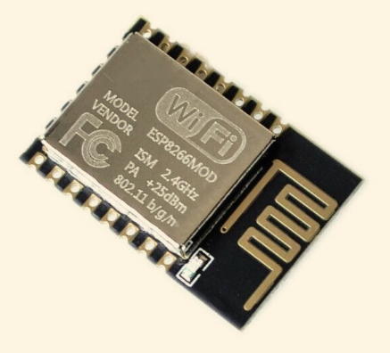
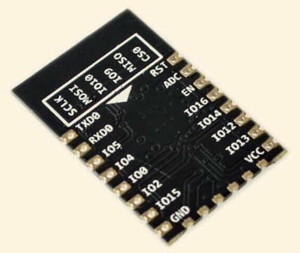

# 펌웨어(Firmware)
> 특정 하드웨어 장치에 포함되어 다른 소프트웨어를 읽어서 실행, 수정을 가능하도록 하는 소프트웨어
> 하드웨어의 제어와 구동을 담당하는 일종의 운영체제.
> 대부분 가전제품 같은곳에 들어가는 단순한 펌웨어는 응용 프로그램의 역할까지 하는 경우가 많다.
- rom에 기록된다.
- 이게 없거나 잘못되면 벽돌이 된다.
- 잘못된 경우 CPU의 디버그 모드를 활성화하고 강제로 펌웨어를 밀어넣으면 복원이 가능하지만 전용 하드웨어가 필요하고 특별한 교육이 필요해서 일반인이 펌웨어가 망가진 디바이스를 자력으로 복구하는것은 매우 어렵다.
- CPU에 디버그모드 자체가 없는 저렴한 부품일 경우 ROM칩을 기판에서 떼내서 펌웨어를 롬 라이터로 써넣은 후 다시 기판에 납땜해서 붙이는 방법으로 복원한다.
- 예) 메인보드의 BIOS, 스마트폰의 Omni

# 아두이노 (Arduino)
- 2005년 이탈리아의 Massimo Banzi와 David Cuartielles가 처음으로 개발한 오픈소스 하드웨어.
- 이탈리아어로 '아르두이노'라고 읽으며 '강력한 친구'라는 뜻
- 간단한 초소형 컴퓨터 기판에 이런저런 기능을 프로그래밍하여 다양한 부품과 연동한다.
- 교육에 특화되어 쉬운 사용법을 자랑하는 시스템
- 주로 Atmel사의 AVR이 보드로 사용된다. 이름앞에 AT가 붙은것들이다.

## 보드 제품
>아두이노의 설계는 CC BY-SA 2.5 라이센스에 따라 공개되어있으므로 누구나 해당 설계도에 따라 제품을 만들수 있다. 따라서 아두이노 LLC에서 직접 판매하는 정품외에도 중국 등에서 만든 호환 보드들이 판매되고 있다. 다만 아두이노라는 이름이나 로고는 함부로 사용할 수 없다.
>> 아두이노는 임베디드 개발 '보드' 에 가깝고   라즈베리파이는 초소형 '컴퓨터'에 가깝다.
- 엔트리 레벨
    - 우노
    - 나노
    - 레오나르도
    - 마이크로
- 하이엔드
    - 메가2560
    - 제로
    - 두에
    - MKR제로
- IoT
    - 우노 와이파이 Rev2
    - MKRFOX1200
    - MKR1000 WIFI

### sketch
아두이노 IDE를 이용해서 만든 프로그램

### MCU
MicroControllerUnit
단일 컴칩내부에 프로세서, 메모리, 입출력장치를 갖춘 장치.

### AVR
Atmel에서 만든 범용 RISC 마이크로 컨트롤러.
안에  CPU, ROM, RAM, 플래시메모리, ADC, DAC, GPIO가 다 들어있다.
아두이노는 AVR을 탑재하고있다.
전기밥솥, 엘리베이터, 자동판매기 등 높은 성능이 필요없고 신뢰성이 필요한 제어장치에 앞으로 계속 8bit MCU가 사용될 것이다.

### RISC 와 CISC
- CISC(Complex Instruction Set Computer
	모든 고급언어 문장들에 대해 각각 기계 명령어가 대응되도록 제작한 프로세서.
- RISC(Reduced Instruction Set Computer)
	CISC중에 많이 쓰이는것만 추려서 하드웨어로 구현. CPU의 명령어를 최소화하여 단순하게 제작한 프로세서.

### 부트로더 (boot loader)
초기적재프로그램. 운영체제가 시동되기 전에 미리 실행되면서 커널이 올바르게 시동되기 위해 필요한 모든 관련작업을 마무리하고 최종적으로 운영체제를 시동시키기 위한 목적을 가진 프로그램

#### 아두이노의 부트로더
아두이노에 부트로드가 설치되어 있어야, 시리얼 통신채널을 통해 Arduiono IDE에서 프로그래밍한 소스코드를 업로드 시킬 수 있다.ㄴ
장착방법 : 메뉴바 - 툴 - 부트로더 굽기

### 어셈블러 (Assembler)
어셈블리어를 기계어 형태의 오브젝트 코드로 해석해주는 컴퓨터 언어 번역 프로그램

#### 어셈블리어
기계어와 일대일 대응이 되는 저급 프로그래밍언어

#### JTAG (Joint Test Action Group)
디지털회로에서 특정노드의 디지털 입출력을 위해 직렬 통신 방식으로 출력 데이터를 전송하거나 입력데이터를 수신하는 방식
임베디드 시스템 개발시 사용하는 디버깅 장비가 대표적인 활용 예

#### 인스펙션

### 온습도센서
https://www.youtube.com/watch?v=-OO0jSmnGUI
https://www.youtube.com/watch?v=cfD3bF5D8Xc&list=PLm2N-HjMCOTrOkL_hhGegXDU3JmofktMX&index=13
IDE열어서 - 스케치 - 라이브러리 포함하기 - 라이브러리 관리 - 라이브러리매니저에서 검색후 설치
adafruit unified
dht sensor  22

### 부품
- 빵판 (bread board) : 가운데 구멍들은 가로로 연결되어있고, 양쪽은 세로로 연결되어있다.
		납땜없이 시제품을 간단하게 구현하기 위해 사용.
- 전압(V = Voltage) : 전위차이    (고 -> 저)
- 전류(I = Current) : 전하의 흐름 ( + -> -)
- 저항(R = Resistance) : 전류가 흐르지 않는 정도
V = IR.    같은 전압일때 저항이 높으면 전류는 낮아진다.

### 데이터시트
부품의 성능, 특성을 모아놓은 문서. 일반적으로 제조사에서 만들게 된다.

### 펌웨어
AVRDUDE(에버두) = 아두이노에 펌웨어를 업로드하거나 아두이노에 업로드되어있는 펌웨어를 다운로드할수 있는 프로그램
소스코드를 분실한 경우 동일한 작동을 하는 아두이노를 만들기 위해 사용. (이를 소스코드로 전환은 할수 없음)

### 드라이버
USB연결후 장치관리자에서 확인했을때 경고면 드라이버가 없다는 것.

### 쉴드
아두이노에 바로 꽂아서 사용할 수 있도록 만든 보드 형태의 모듈

#### 14. 펌웨어 구현 환경 구성 (문제해결 시나리오 = 문제해결을 위한 시나리오 작성하고 해결에 이르는 과정을 평가)
**컴퓨터에 연결하고 IDE후 LED sample**
https://turtleshell.kr/113

- ##### 지식
우리가 쓰는 NodeMCU라는 보드는 아두이노와 비슷한 오픈소스 펌웨어의 일종.
엄밀하게 말하면 ESP8266 보드에, USB, RAM 등을 통합하고 여기에 NodeMCU펌웨어를 올린것.
펌웨어 = 특정 임베디드 장치에 내장되어 하드웨어와 소프트웨어를 연결해준다.
펌웨어 다운로드 : https://github.com/nodemcu/nodemcu-firmware
펌웨어 업데이트 과정이 소프트웨어적으로도, 하드웨어적으로도 어렵다.
그래서 초보는 통신 및 플래시 회로와 USB포트, 리셋이 구성된 NodeMCU 보드 등을 사용하는 것이 필수.
구글에 nodemcu v1.0 datasheet 쳐서 데이터시트를 구한다.
- ##### 목표
1. 아두이노 IDE 다운후 설치
2. 아두이노 IDE 실행
3. ESP8266에 펌웨어를 가지고있는 링크 구하기
4. 구한 URL을 보드매니저를 통해 추가후 적당한 버전 설치
5. 보드선택 : 툴 - board
6. 포트 선택 : 툴 - 포트
7. 파일 - 예제 - basics - blink
8. 컴파일
9. 업로드 후 간단한 테스트

- ##### 답
1. 아두이노 IDE 다운로드후 실행
https://blog.naver.com/PostView.naver?blogId=eduino&logNo=222033723691
운영체제 찾아서 클릭한다음 just download버튼
arduino 버전xxx.exe 실행하여 install
(이때 driver도 함께 설치된다.)

2. 설치가 끝났으면 Arduino 실행파일 실행
3. 파일- 환경설정 - 추가적인 보드 매니저
http://arduino.esp8266.com/stable/package_esp8266com_index.json
입력후 확인.
4. 툴 - 보드 - 보드매니저
ESP8266검색후 ESP8266 Community 설치
esp8266은 아두이노에서 제공하는 하드웨어가 아니라서 위의 추가적인 url을 받는 작업을 해줬다. 아니면 기본보드에 있다.
드라이버가 정상적으로 설치되었다면 이제 보드가 인식되고 이제는 훨씬 많은 보드들을 
IDE - 툴 - 보드 리스트에서 확인할 수 있다.
5. NodeMCU 와이파이 보드 사용.
IDE - 툴 - 보드 - NodeMCU 1.0(ESP-12E Module) 선택하고 스샷

#### 15. 펌웨어 구현 (문제해결 시나리오 = 문제해결을 위한 시나리오 작성하고 해결에 이르는 과정을 평가)
**온습도 센서**
펌웨어를 설치가 아니라 구현이라니... 하드웨어, 운영체제에 대한 깊은 이해가 필요하다.

#### 16. 디바이스 드라이버 구현 (문제해결 시나리오 = 문제해결을 위한 시나리오 작성하고 해결에 이르는 과정을 평가)
**와이파이 연결 검증**
드라이버를 설치가 아니라 구현이라니... 하드웨어, 운영체제에 대한 깊은 이해가 필요하다.
ESP8266 / ESP32의 아두이노 코어의 기본 라이브러리인 HTTPClient.h

- ##### 지식
원래 와이파이는 2.4ghz의 대역폭을 쓰다가 최근에는 5gHz 지원하고있다.
두개 대역의 SSID를 동시에 제공하는것을 '듀얼밴드' 공유기라고 한다.
주파수(진동수) 와 파장은 반비례 관계이므로 주파수가 높다는 것은 파장이 길다는 것
2.4GHz는 파장이 길기때문에 장애물에 강하고 호환성 좋다.
그러나 esp8266은 5GHz의 주파수는 지원하지 않는다.
와이파이 연결할때 SSID뜨는곳에서 이름에서 확인하고, 모르겠으면 디테일정보보면 채널 정보에서 확인.
esp8266은 b, g, n 3가지의 와이파이 규격을 지원하니 접속하려는 공유기가 저걸 지원하는지 확인해야한다.
대부분의 공유기는 지원한다. 와이파이 상세정보의 PHY 모드 뒤의 소문자번호 확인.
보드선택해서 wifi 예제 코드 가져오면 되는데 좀 복잡한 코드라서
https://github.com/LOVOTLAB/youtube/tree/master/ESP8266/simpleWifiConnection 이거 사용.
#include <ESP8266Wifi.h>  를 첫줄에서 사용하고있다.
Wifi.begin에 wifi이름과 비밀번호 파라미터로 전달
포트 선택하고 업로드
시리얼모니터를 통해 접속 확인 (**주의** : 설정한 시리얼번호와 시리얼출력 확인할때의 번호 같아야 함)

- ##### 목표
1. 구현해야할 드라이버의 디바이스가 무엇인지 파악하여라.
2. 드라이버 디바이스 설계자료를 구하여라.
    (URL 또는 다운받은 설계도 스샷)
3. 설계자료를 기준으로 디바이스의 초기화(로드)를 하여라.
4. 드라이버 검증을 위한 테스트 코드를 작성하여라.
   1. 주석으로 기능에 대한 설명을 하여라.
   2. 예상되는 문제와 가능한 해결책을 함께 담아주어라.
5. 컴파일 후 에러가 있다면 수정
6. 업로드후 프로그램을 실행
※미작성시 수행준거(평가내용)별 기본점수를 1점(매우미흡)으로 부여한다.

#### 17. 임베디드 애플리케이션 구현 (포트폴리오 = 소스와 스샷)
**인터넷을 통해 원격 led 제어**
https://github.com/LOVOTLAB/youtube/tree/master/ESP8266/webServerBULB
- ##### 목표
1. 와이파이 라이브러리 첨부
2. 웹서버 라이브러리 첨부
3. setup에서 led, serial접속
4. setup에서 와이파이 접속
5. 반복문에서 서버의 handle함수 호출
6. 각 요청마z다 처리할 핸들함수 정의
7. 각 요청마다 처리할 핸들함수 매핑
8. 테스트

#### 18. 오픈 플랫폼 활용 (포트폴리오)
https://jpal.tistory.com/442
- ##### 목표
공공데이터포털 대기오염정보 API 가져와서 파싱후에 LED 불켜기
1. 3색 LED 빨강, 초록, 파랑 불켜보기
   RGBled2.ino
2. 공공데이터포탈 회원가입
https://www.data.go.kr
1. 한국환경공단_에어코리아_대기오염통계 현황 조회서비스 신청
https://www.data.go.kr/data/15073855/openapi.do
3. 활용목적 - 기타 : 공공데이터 활용 학습
활용신청하면 바로 인가됨
4. 기본url : http://apis.data.go.kr/B552584/ArpltnStatsSvc
공식문서보기
시도별 실시간 평균정보 상세조회 : http://apis.data.go.kr/B552584/ArpltnStatsSvc/getCtprvnMesureLIst
요청메세지 명세 : http://apis.data.go.kr/B552584/ArpltnStatsSvc/getCtprvnMesureLIst?itemCode=PM10&dataGubun=HOUR&pageNo=1&numOfRows=100&returnType=xml&serviceKey=서비스키
5. 일반인증키 넣으면됨
6. 코드로 데이터 받아오기
   publicAir.ino
7. 컴파일해서 데이터 출력해보기
8. 입맛대로 수정

### 라이브러리 추가하는법
https://codingrun.com/100